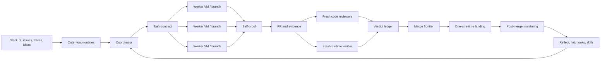

# Nine layers (the factory)

**INFERENCE** of architecture from public posts + **VERIFIED** pstack pieces. The workflow is not a better prompt template. It is a small software factory.

## The nine layers

1. **Outer loop collects work** — bots/routines farm bugs, complaints, ideas, history, ops signals ([outer-loop.md](outer-loop.md), [benny-line.md](benny-line.md)). Intake classifies and briefs; it does not immediately edit production code.
2. **A coordinator owns the program** — briefs, state, gates, dispatch. It should **not** write production code on large programs ([orchestration.md](orchestration.md)).
3. **One owner per implementation unit** — self-contained contract; writes only its branch / worktree / cloud VM.
4. **A router chooses the playbook** — human states outcome + proof; `/poteto-mode` picks ceremony ([prompting-model.md](prompting-model.md), [pstack-inventory.md](pstack-inventory.md)).
5. **The app is agent-controllable** — verify skill + control CLI + Feature Map ([feature-maps.md](feature-maps.md), [atlas-control.md](atlas-control.md)).
6. **Authors do not certify themselves** — fresh reviewers + fresh runtime verifiers; model diversity for blind spots ([evals.md](evals.md), [pr-workflow.md](pr-workflow.md)).
7. **PRs are narrow and durable** — small, ordered, independently verifiable ([pr-workflow.md](pr-workflow.md)).
8. **The system learns structurally** — repeated corrections → lint / hook / map / skill / playbook ([quality-ladder.md](quality-ladder.md), [principles.md](principles.md)).
9. **Cloud removes the laptop bottleneck** — isolated agents keep running; branches, PRs, artifacts, ledgers outlive any chat ([spend-and-cloud.md](spend-and-cloud.md)).

**Load-bearing dependency:** verification infrastructure. Parallelising an agent that cannot prove its work only produces mistakes faster.

## Six planes (same system, cut another way)

| Plane | Owns |
|-------|------|
| **Outer loop** | What deserves factory capacity |
| **Control** | Predicate, decomposition, constraints, briefs, queue, ledger, frontier, human gates |
| **Execution** | One outcome per worker; exclusive writable scope; VERIFY commands; report schema |
| **Verification** | Launch, drive, evidence, cleanup — product capability, not a final `npm test` |
| **Review / verdict** | Owner ≠ reviewer ≠ verifier ≠ coordinator ≠ human product call |
| **Delivery** | Narrow PRs, babysit frontier, independent SHA-tied verdicts, bottom-up land |

A green build is compilation evidence, not a behavioural verdict.

## Four pieces she named (SELF-REPORTED, Aug 2026)

1. `pstack` (`/lauren-mode` internal → public `/poteto-mode`)
2. Grok Bot outer-loop routines
3. `/goal`, `/loop`, `/swarm` inside Full Autopilot
4. Cursor Cloud Agents 24/7

Full ceiling: [match-ceiling.md](match-ceiling.md) · evidence labels: [evidence-standard.md](evidence-standard.md) · why volume emerges: [why-throughput.md](why-throughput.md).
